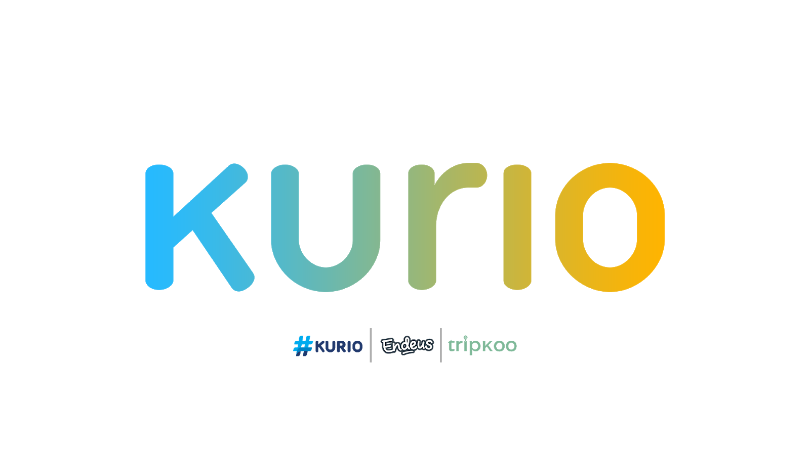

# Internship - Frontend (Web) Engineer

Are you the engineer who just loves building stuffs? In Kurio we are constantly building awesome products for our internal or end users. As a Frontend web engineer, HTML, CSS and Javascript are our bread and butter. But we also strive to be up-to-date with state-of-the-art web technologies, along with clean written codes paired with best practices. Beautiful is the goal we set to aim.

## What you will do

- Build and maintain production-level websites
- UI Testing

## Qualifications

- Kurio's values (Get sh*t done, Be Bold, Stay Curious, Excellence, Collaboration)
- Able to build a website with HTML, CSS and Javascript
- Understand the very basic concept of REST API
- Familiar with Git

## Preferred qualifications

- Knowledge in Web frontend framework / library (React / Angular / Vue etc.)
- Knowledge in UI / UX design is a big plus
- Experienced on building a server-side renderred website
- Knowledge in Search Engine Optimization (SEO)
- Strong knowledge in Javascript (and its concept of OOP)
